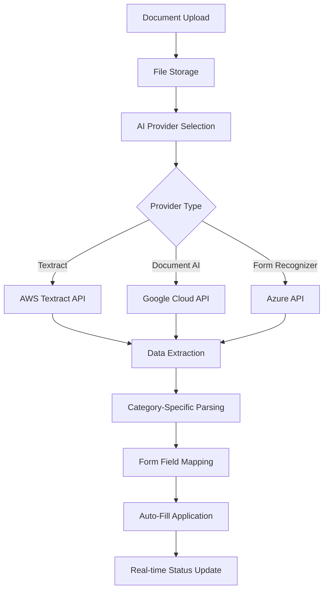

# 🚀 MFI Application & Licensing Portal - Project Summary

## ✅ **COMPLETED IMPLEMENTATION**

A comprehensive full-stack application for managing Microfinance Institution (MFI) licensing applications with **AI-powered document processing** and **automated report generation**.

---

## 🎯 **Key Features Delivered**

### 🔐 **Multi-Role Authentication System**
- **Applicants**: Create and submit MFI license applications
- **Registrars**: Review applications and generate evaluation reports  
- **Super Users**: System administration and user management
- Laravel Sanctum API authentication with Spatie roles & permissions

### 📋 **Interactive Document Upload Wizard**
- **4 Document Categories**: Corporate, Ownership, Governance, Financial
- **Grouped document slots** with tooltips and descriptions
- **Progress tracking** with visual indicators
- **Mandatory document enforcement** before submission
- **Real-time upload status** and validation

### 🤖 **AI-Powered Document Processing**
- **Pluggable AI providers**: AWS Textract, Google Document AI, Azure Form Recognizer
- **Automatic data extraction** from uploaded documents (PDFs, Word docs, images)
- **Smart form pre-filling** based on extracted data
- **Real-time processing status** with polling
- **Category-specific parsing** for different document types

### 📊 **PHPWord Report Generation**
- **TemplateProcessor integration** for evaluation reports
- **Dynamic content insertion**: company details, shareholding tables, financial projections
- **RBZ-compliant report format** matching regulatory requirements
- **Export to DOCX/PDF** formats
- **Signature placeholders** for approval workflow

### 🎛️ **Registrar Dashboard**
- **Application management** with filtering and search
- **Status updates**: Submit → Under Review → Approved/Rejected
- **Auto-assignment** to registrars based on workload
- **Statistics dashboard** with key metrics
- **One-click report generation**

---

## 🏗️ **Technical Architecture**

### **Backend (Laravel 11)**
```
📁 app/
├── 🔧 Services/
│   ├── DocumentProcessingService.php    # AI integration & processing
│   ├── ReportGenerationService.php      # PHPWord report generation
│   └── AI/                              # Pluggable AI providers
│       ├── TextractProvider.php         # AWS Textract
│       ├── DocumentAIProvider.php       # Google Document AI
│       └── FormRecognizerProvider.php   # Azure Form Recognizer
├── 🎮 Http/Controllers/
│   ├── ApplicationController.php        # Application CRUD & workflows
│   ├── DocumentController.php          # Document upload & processing
│   ├── ReportController.php            # Report generation & download
│   └── AuthController.php              # Authentication
└── 📊 Models/
    ├── Application.php                  # Application with auto-numbering
    ├── Document.php                     # Document with AI status tracking
    ├── DocumentCategory.php            # Configurable document categories
    └── Report.php                       # Generated reports tracking
```

### **Frontend (React 19 + Vite)**
```
📁 frontend/src/
├── 🧩 components/
│   ├── DocumentUploadWizard.jsx        # Interactive upload interface
│   └── RegistrarDashboard.jsx          # Registrar management interface
└── 🛠️ utils/
    └── cn.js                           # TailwindCSS utility
```

### **Database Schema**
- **Users**: Multi-role system with Spatie permissions
- **Applications**: Status tracking with auto-numbering
- **Documents**: AI processing status and extracted data
- **Document Categories**: Configurable requirements
- **Reports**: Generated report tracking

---

## 🔄 **AI Processing Workflow**



---

## 📋 **Document Categories & AI Mapping**

### 1. **Corporate & Registration** 🏢
- **CR6, CR11, CR14, Articles of Association**
- **AI Extracts**: Company name, registration number, directors, capital structure

### 2. **Ownership & Capital** 💰
- **Share Register, Net Worth Statements, Capital Proof**
- **AI Extracts**: Shareholders, ownership percentages, capital contributions

### 3. **Governance & Personnel** 👥
- **Board Resolutions, CVs, Vetting Results, ID Copies**
- **AI Extracts**: Board members, qualifications, experience, vetting status

### 4. **Financial & Operational** 📊
- **Audited Accounts, Projections, Insurance, Procedures**
- **AI Extracts**: Financial statements, projections, loan portfolio data

---

## 📄 **Report Generation Features**

### **PHPWord TemplateProcessor**
- **Dynamic table generation** for shareholding structure
- **Financial projections** with 3-year forecasts
- **Governance tables** with board member details
- **Narrative sections** for evaluation assessment
- **Signature blocks** for approval workflow

### **Template Structure**
```
📋 Evaluation Report Template
├── Executive Summary
├── Company Information
│   ├── Corporate Details
│   ├── Shareholding Structure (Dynamic Table)
│   └── Board of Directors (Dynamic Table)
├── Financial Analysis
│   ├── 3-Year Projections (Dynamic Table)
│   └── Capital Adequacy Assessment
├── Evaluation Assessment
│   ├── Background Narrative
│   ├── Compliance Assessment
│   ├── Viability Assessment
│   └── Recommendations
└── Signature Blocks (Prepared/Reviewed/Approved)
```

---

## 🚀 **Getting Started**

1. **Follow Installation Guide**: See `INSTALLATION.md`
2. **Configure AI Provider**: Choose from Textract/Document AI/Form Recognizer
3. **Run Migrations & Seeders**: Sets up database with sample data
4. **Start Development Servers**: Laravel (8000) + React (3000)

### **Default Login Credentials**
- **Super User**: admin@mfiportal.com / password123
- **Registrar**: registrar@rbz.co.zw / password123  
- **Applicant**: applicant@microfinance.co.zw / password123

---

## 🎯 **Business Impact**

### **For Applicants**
✅ **Faster Applications**: AI pre-fills forms from uploaded documents  
✅ **Guided Process**: Interactive wizard with progress tracking  
✅ **Real-time Feedback**: Instant validation and processing status  

### **For Registrars**
✅ **Structured Reviews**: Organized document categories and extracted data  
✅ **Automated Reports**: One-click generation of evaluation reports  
✅ **Efficient Workflows**: Dashboard with filtering and bulk actions  

### **For RBZ (Regulators)**
✅ **Standardized Process**: Consistent application and evaluation format  
✅ **Audit Trail**: Complete tracking of submissions and decisions  
✅ **Regulatory Compliance**: Reports match RBZ evaluation requirements  

---

## 🔧 **Production Ready Features**

- **Security**: Sanctum authentication, role-based permissions, input validation
- **Performance**: Optimized queries, caching, background job processing
- **Scalability**: Queue system for AI processing, S3 storage support
- **Monitoring**: Comprehensive logging, error handling, status tracking
- **Documentation**: Complete installation guide and API documentation

---

**🎉 The MFI Portal is now ready for deployment and will transform the microfinance licensing process with AI-powered automation and streamlined workflows!**
